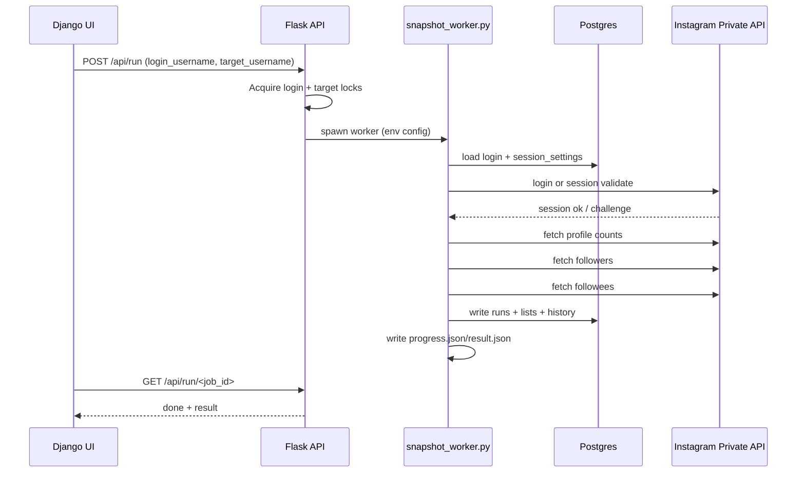
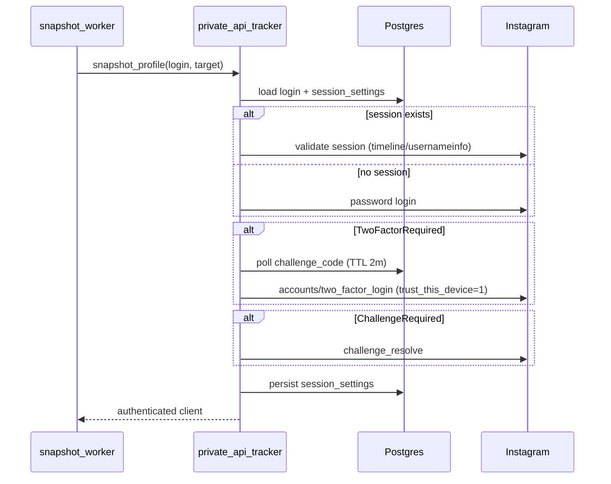
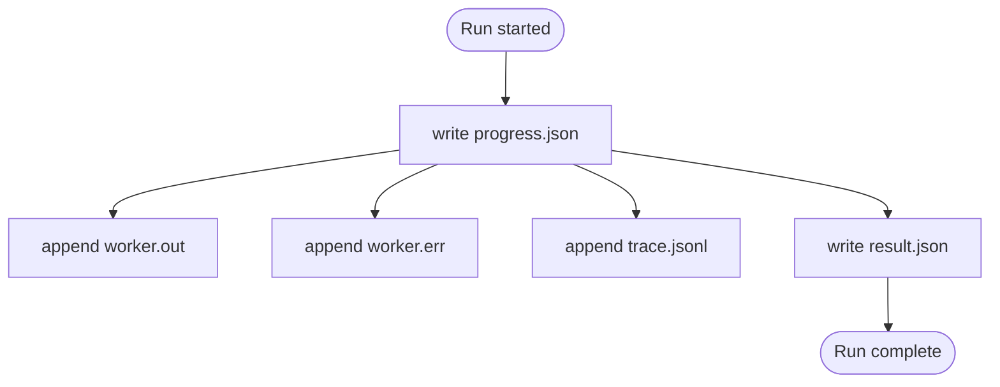

# InstaLab Architecture

_Last updated: 2026-02-04_

This document describes the internal architecture, data flow, and runtime behavior of InstaLab. It is intended for debugging and on‑call troubleshooting.

## High‑level overview

**Core services (two containers):**
- **Flask API** (`app/server.py`) – orchestration + REST API + workers
- **Django UI** (`app/django_app/`) – dashboard + API proxy (`/api/*`)

**Execution model:**
- API launches snapshot/count/unfollow workers via a **ThreadPoolExecutor**.
- Jobs write artifacts to `/data/instalab/job_runs/job_<id>/`.
- UI polls `/api/status` for active jobs and `/api/jobs/latest` for log/trace tails.

## System context diagram

```mermaid
flowchart LR
  user[User/Operator] --> ui[Django UI]
  ui --> api[Flask API]
  api --> pg[(Postgres)]
  api --> worker[Snapshot/Count/Unfollow Workers]
  worker --> ig[Instagram Private API]
  worker --> pg
  worker --> files[/data/instalab/job_runs/]
  ui <-- api
```

## Data flow (snapshot run)

1. **Run request** – `POST /api/run` with `login_username` + `target_username`.
2. **Locks** – per‑login and per‑target locks prevent overlapping jobs.
3. **Worker spawn** – `snapshot_worker.py` starts with env‑based configuration.
4. **Login/session** – instagrapi loads cached session settings (Postgres + file fallback) or performs login.
5. **Fetch** – private API calls fetch profile, followers, and followees.
6. **Persist** – results written to Postgres (`runs`, `run_followers`, `run_followees`, history tables).
7. **Artifacts** – `progress.json`, `result.json`, `worker.out`, `worker.err`, `trace.jsonl` saved in job dir.

### Sequence diagram (run lifecycle)



## Components

### 1) Flask API (`app/server.py`)

Responsibilities:
- Run orchestration (`/api/run`, `/api/run/<job_id>`, `/api/run/cancel`).
- Job lifecycle tracking (`RUN_META`, `RUN_FUTURES`, `ACTIVE_JOBS`).
- Schedules (APScheduler + cron expressions).
- Configuration storage (`config` table; `/api/config`).
- Proxy config and health checks.
- Login admin endpoints (challenge/TOTP/password reset).

Concurrency:
- `ThreadPoolExecutor(max_workers=3)`
- Per‑login lock: `_get_run_lock(login)`
- Per‑target lock: `_is_target_busy(target)`

Job artifacts:
- `/data/instalab/job_runs/job_<id>/progress.json`
- `/data/instalab/job_runs/job_<id>/result.json`
- `/data/instalab/job_runs/job_<id>/worker.out`
- `/data/instalab/job_runs/job_<id>/worker.err`
- `/data/instalab/job_runs/job_<id>/trace.jsonl`

### 2) Snapshot worker (`app/snapshot_worker.py`)

- Loads env config from the API.
- Emits progress phases: `login → totals → followers → following`.
- Writes `progress.json` and `result.json`.
- Streams stdout/stderr to job files.
- Uses **instagrapi** via `private_api_tracker.snapshot_profile()`.

### 3) Private API tracker (`app/private_api_tracker.py`)

Core behaviors:
- Instagrapi client with persisted **device profile + UUIDs**.
- Session settings stored in Postgres; fallback JSON in `/data/instalab/private`.
- Login flow with:
  - `trust_this_device=1` for 2FA
  - `challenge_resolve()` on checkpoints
  - `handle_exception` for retries
- Two‑factor handling:
  - TOTP seed stored encrypted
  - SMS/email codes stored via `/api/logins/challenge`
  - **Code TTL = 2 minutes**
- Optional per‑run trace logging (`trace.jsonl`) capturing request/response summaries.

### 4) Login storage (`app/login_store.py`)

- Table: `login_accounts`
- Encrypted fields via Fernet:
  - `login_password_enc`
  - `totp_seed_enc`
  - `challenge_code_enc`
  - `new_password_enc`
- Session settings stored in JSONB column `session_settings`.

### 5) Django UI (`app/django_app/`)

- Renders dashboard + settings.
- Proxies `/api/*` to Flask API.
- Accounts modal includes:
  - Login add/update
  - Challenge code
  - TOTP management
  - Worker log + trace tail

### 6) Count worker (`app/count_worker.py`)

- Lightweight follower/following count check.
- Stores `count_checks` records.
- Can auto‑trigger snapshot when delta exceeds threshold.

### 7) Unfollow worker (`app/unfollow_bot.py`)

- Uses the latest non‑followback list from snapshot runs.
- Enforces batch size and delay settings.
- Writes unfollow results to `unfollow_actions`.

## Login + 2FA flow (detailed)



## Job artifact flow



## Storage & schema (Postgres)

Key tables:
- `runs` – metadata per snapshot
- `run_followers` / `run_followees` – snapshot lists
- `followers_history` / `followees_history` – churn tracking
- `count_checks` – monitor probes
- `login_accounts` – encrypted login + session cache
- `config` – runtime config
- `schedules` – cron schedules
- `unfollow_actions` – audit trail of unfollows

## Configuration

Stored in Postgres `config` table. Defaults are defined in `server.py` (`CONFIG_DEFAULTS`).

Important keys:
- Runner: `run_stall_seconds`, `run_max_seconds`, `run_request_timeout`, `run_item_delay_min/max`
- Login mode: `run_login_mode` (`auto`, `session_only`, `password`)
- Trace logging: `run_trace_enabled`
- Proxy: `proxy_enabled`, `proxy_host`, `proxy_port`, `proxy_username`, `proxy_password`
- Monitor: `monitor_interval_minutes`, `monitor_threshold_delta`

## Proxy

- Native proxy only (Decodo). Configured via `/api/config`.
- Worker uses `HTTP_PROXY` / `HTTPS_PROXY` env.
- `/api/proxy/test` validates proxy connectivity.

## Observability

- Worker logs: `worker.out` / `worker.err` (also streamed to container stdout).
- Run trace: `trace.jsonl` (private API request/response summaries).
- APM: API/UI/worker run under `ddtrace-run` (optional).

## Failure modes & debugging

- **Run stuck in `login`** → check `trace.jsonl` + `worker.err` for 2FA/challenge.
- **No active job in UI** → `/api/status` only shows active jobs; use `/api/jobs/latest` for finished job logs.
- **Repeated “new device” logins** → ensure device profile persisted and `trust_this_device=1`.
- **Proxy errors** → verify `/api/proxy/test` and required proxy credentials.

