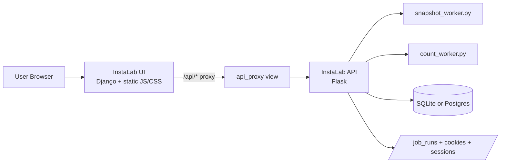
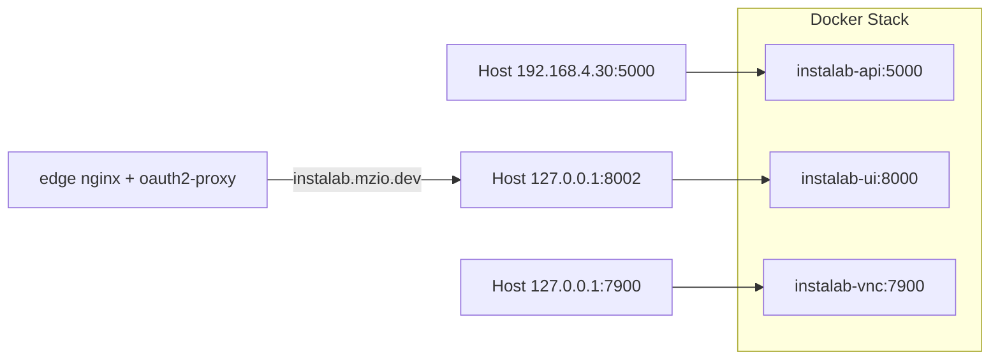
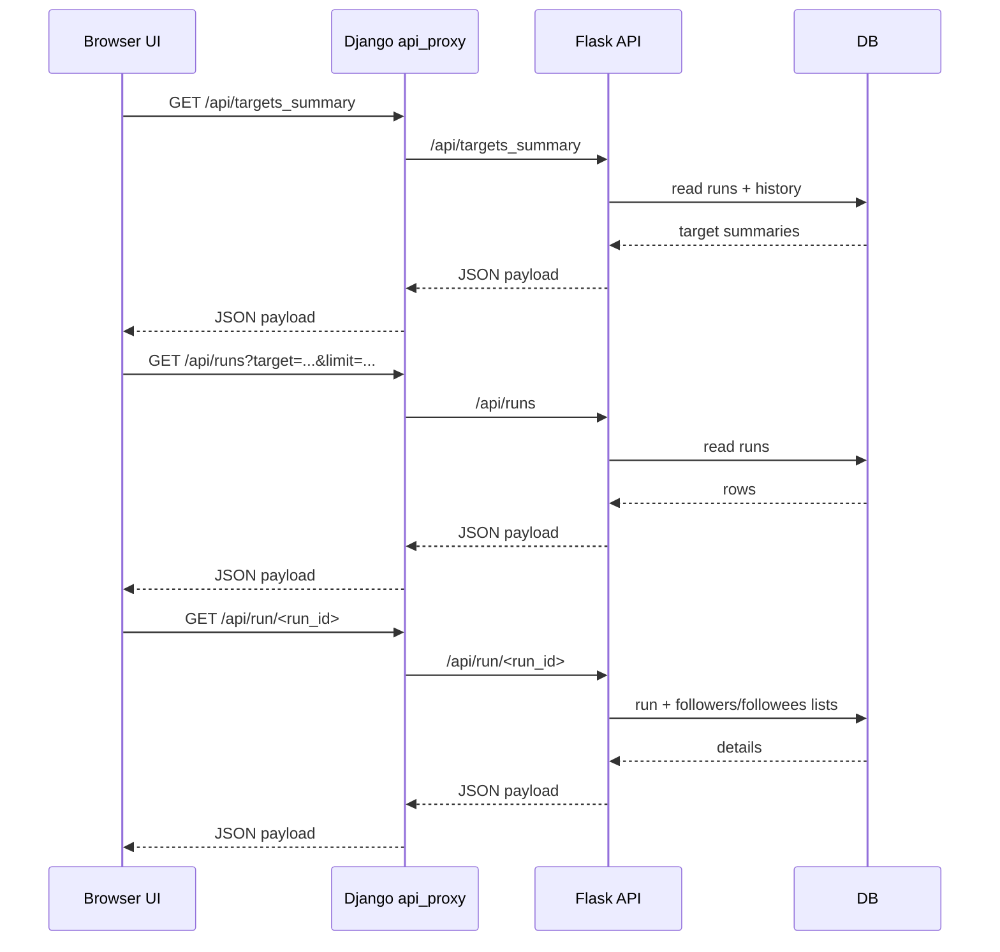
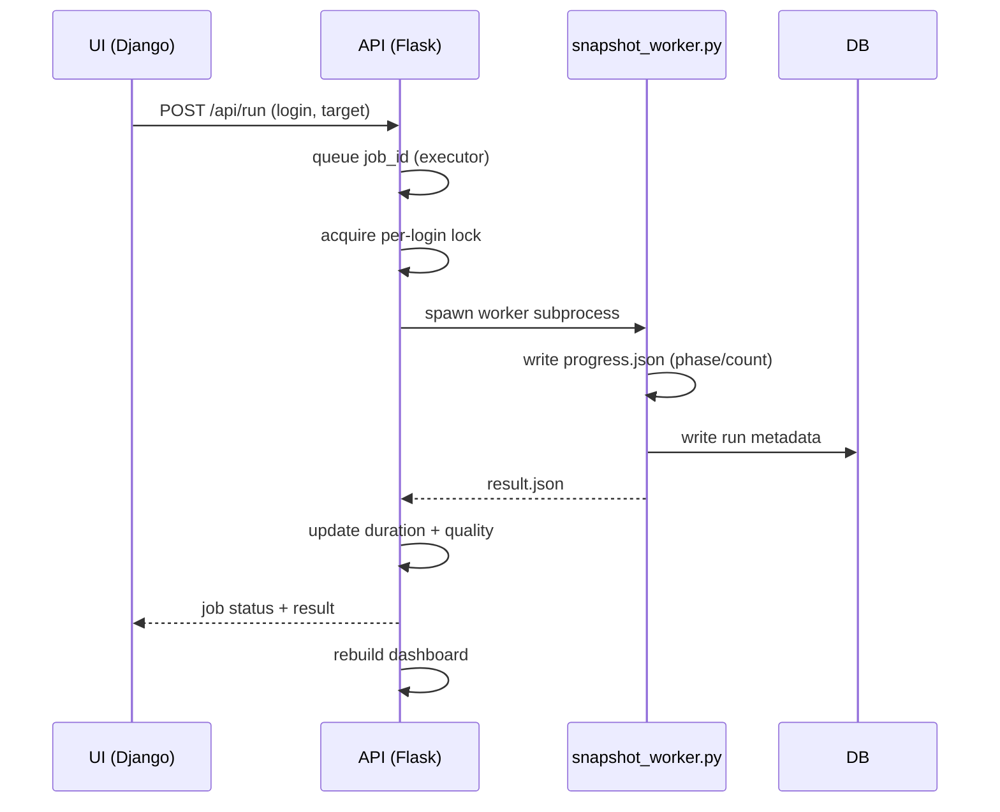
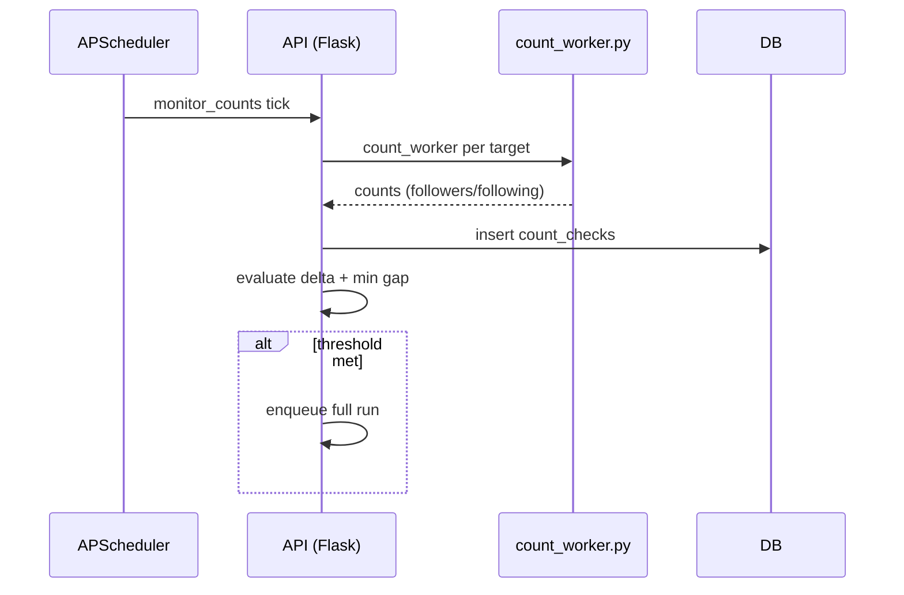
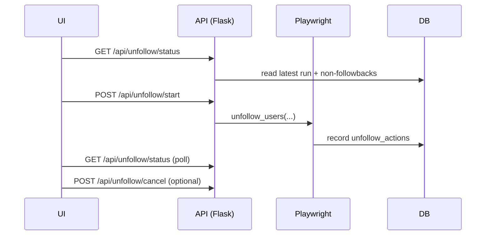
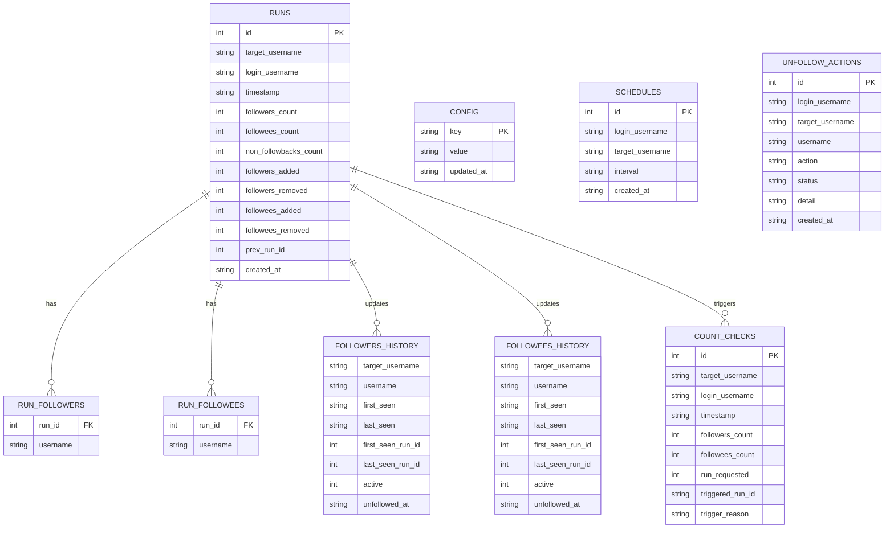

# InstaLab Overview

Last updated: 2026-02-01

## What it is
InstaLab is a single‑pane operations console for Instagram snapshot runs (followers/following), scheduling, run history, insights, and unfollow cleanup. It runs as a 3‑container Docker stack with a Flask API, a Django UI, and a VNC/noVNC container for interactive login workflows.

## High‑level architecture

User Browser
  -> InstaLab UI (Django + static JS/CSS)
     -> /api/* proxy (Django)
        -> InstaLab API (Flask)
           -> Workers (snapshot_worker.py / count_worker.py)
           -> DB (SQLite or Postgres)
           -> Files (job_runs, cookies, sessions)

## Services, ports, and containers

Containers (docker‑compose.yml):
- instalab-api
  - Flask API on :5000 (host 192.168.4.30:5000)
  - Entry: `ddtrace-run python server.py`
- instalab-ui
  - Django + Gunicorn on :8000, bound to host 127.0.0.1:8002
  - Entry: `ddtrace-run gunicorn controlpanel.wsgi:application --chdir /app/django_app --bind 0.0.0.0:8000`
- instalab-vnc
  - Xvfb + fluxbox + x11vnc + noVNC
  - noVNC bound to host 127.0.0.1:7900

External access:
- UI via nginx: http://192.168.4.30:8000
- UI direct (local only): http://127.0.0.1:8002
- API: http://192.168.4.30:5000
- Public SSO: https://instalab.mzio.dev (edge oauth2‑proxy)

Optional preview stack (docker-compose.preview.yml):
- API preview: http://192.168.4.30:5002
- UI preview: http://192.168.4.30:8003

## Filesystem layout

Code:
- /srv/apps/instalab/app

Data:
- /srv/data/instalab
  - instaloader.db (SQLite) (symlinked from /srv/apps/instalab/app/instaloader.db)
  - job_runs/ (per‑run artifacts: progress.json, result.json, worker logs)
  - home/ (home dir for instaloader sessions, etc)
  - cookies/ (cookie files)
  - data_* (per‑target data directories)

Secrets:
- /srv/secrets/instalab.env (primary env)
- /srv/secrets/instalab-logins.json (login profiles)
- /srv/secrets/instalab-cookies (cookie store)

## Environment and configuration

Key env values (from instalab.env):
- INSTALAB_DB_TYPE=sqlite|postgres
- INSTALAB_DB_HOST / INSTALAB_DB_NAME / INSTALAB_DB_USER / INSTALAB_DB_PASS
- INSTALAB_SQLITE_PATH (default: /srv/apps/instalab/app/instaloader.db)
- INSTALAB_API_BASE (used by Django for proxy)
- INSTALAB_SCRAPER_BACKEND=instaloader|selenium
- INSTALAB_LOGINS_FILE (default: /srv/secrets/instalab-logins.json)
- INSTALAB_COOKIE_DIR (default: /data/instalab/cookies)
- INSTALAB_BLOCKED_LOGINS (comma‑separated)

Runtime config values are stored in DB table `config` and exposed via the API:
- run_* safeguards, UI timezone, schedule defaults, monitor thresholds, unfollow defaults.

## UI (Django) anatomy

Routes:
- `/` -> dashboard/index.html
- `/mocks` -> static mock page
- `/api/<path>` -> proxy to Flask API

Proxy behavior:
- All `/api/*` requests are forwarded to `INSTALAB_API_BASE`.
- No server‑side rendering; UI is a JS‑driven SPA.

Main UI sections:
- Overview: KPIs, queue flow, live lanes, run launcher, cleanup runbook
- Explorer: run history drilldown, per‑run diffs, CSV exports
- Modals: Schedules, 2FA, Config, Accounts

UI build pipeline:
- Source: `/srv/apps/instalab/app/ui_src/ui.css`
- Output: `/srv/apps/instalab/app/django_app/static/ui.css`
- Build: `npm run build` (minified), `npm run dev` (watch)
- Tailwind config: `/srv/apps/instalab/app/tailwind.config.js` (template + static scan paths)

## API (Flask) overview

### Core endpoints
Logins:
- GET /api/logins
- POST /api/logins/add
- POST /api/logins/reset
- POST /api/logins/delete

Targets + runs:
- GET /api/targets
- GET /api/runs?target=&limit=
- GET /api/run/<run_id>
- POST /api/run
- GET /api/run/<job_id>
- GET /api/jobs/<job_id>/detail
- POST /api/run/cancel
- DELETE /api/run/<run_id>
- POST /api/run/undo/<run_id>

Schedules:
- GET /api/schedules
- POST /api/schedules
- PUT /api/schedules/<id>
- DELETE /api/schedules/<id>

Monitoring + insights:
- GET /api/monitor/status
- GET /api/last_status
- GET /api/targets_summary
- GET /api/insights/followers?target=&kind=followers|following&days=N
- GET /api/summary

Config + health:
- GET /api/config
- PUT /api/config
- GET /api/health
- GET /api/health/detail

Unfollow:
- GET /api/unfollow/status
- GET /api/unfollow/preview
- POST /api/unfollow/start
- POST /api/unfollow/cancel
- POST /api/unfollow/init

Misc:
- POST /api/import/osintgraph
- POST /api/rebuild

### Run lifecycle

1) UI triggers `POST /api/run` with login + target
2) Flask queues a job in ThreadPoolExecutor (job_id)
3) `guarded_run` enforces one run per login; uses `RUN_LOCKS`
4) `snapshot_worker.py` is launched via subprocess
5) Worker writes:
   - progress.json (phase + counts)
   - result.json (summary payload)
6) Flask polls progress, enforces:
   - stall timeout
   - max runtime
   - cancel requests
7) On success:
   - run metadata inserted
   - run duration + confidence updated
   - dashboard rebuilt

### Monitoring flow

- APScheduler interval job (`monitor_counts`)
- For each target:
  - run `count_worker.py` (lightweight counts)
  - compare delta vs last check
  - if delta >= threshold and gap exceeded, enqueue full run
- All checks recorded in `count_checks` table

### Unfollow flow

1) UI calls `/api/unfollow/status` to compute eligible accounts
2) `/api/unfollow/start` launches `_unfollow_worker` (Playwright)
3) `unfollow_users` performs UI‑based unfollows with delay/jitter
4) Actions recorded in `unfollow_actions` table
5) Cancel handled via `/api/unfollow/cancel`

## Workers and scraping backends

### snapshot_worker.py
- Reads env RUN_LOGIN_PASSWORD and optional cookie file
- Selects backend:
  - instaloader_tracker (default if INSTALAB_SCRAPER_BACKEND=instaloader)
  - selenium_tracker (otherwise)
- Emits progress JSON (phase: totals, followers, following)
- Writes result JSON with counts and fetch durations

### count_worker.py
- Same backend selection
- Fetches followers/followees counts only
- Used by monitor job

### instaloader_tracker.py (Instaloader backend)
- Uses instaloader sessions in ~/.config/instaloader
- Supports cookie bootstrap (MozillaCookieJar)
- Generates full follower/followee lists
- Writes run metadata and history tables

### selenium_tracker.py (Selenium backend)
- Uses Chromium/Chrome + chromedriver
- Cookie import and interactive login support
- Scrapes follower/following lists via scrolling dialogs

### unfollow_bot.py (Playwright)
- Uses storage_state file for login persistence
- Performs batch unfollows with rate‑limit protection
- Captures IG errors (feedback_required) and aborts on repeated failures

## Utility scripts and migrations

Scripts in `/srv/apps/instalab/app/scripts`:
- `import_osintgraph.py`: pull followers/following from Neo4j (osintgraph) and POST to `/api/import/osintgraph`.
  - Reads Neo4j creds from osintgraph venv or `/srv/secrets/neo4j.env`.
- `migrate_sqlite_to_postgres.py`: migrate SQLite data to Postgres (runs DDL and copies tables).
- `selenium_login.py`: interactive Selenium login in VNC to export Netscape cookie file.
- `start_vnc.sh`: entrypoint for Xvfb + fluxbox + x11vnc + noVNC.

Other migration helper:
- `/srv/apps/instalab/app/migrate_json_to_sqlite.py`: import legacy `data_*` JSON snapshots into SQLite.

## VNC-based login (cookie capture)

Purpose: create/refresh Netscape cookies for scraper auth via VNC.

Access:
- noVNC (local only): `http://127.0.0.1:7900`

Flow:
1) Run on host:
   - `python /srv/apps/instalab/app/scripts/selenium_login.py --login <instagram_user> --cookie-out /srv/secrets/instalab-cookies/cookies_<instagram_user>.txt --display :1`
2) Open the noVNC URL, complete Instagram login in the browser.
3) Press ENTER in the terminal running the script to export cookies.

Notes:
- Cookie files are used by snapshot/count workers.
- Unfollow uses Playwright storage state (separate from cookie files).

## DB schema summary

Defined in instaloader_tracker.py + server.py.

Core tables:
- runs
- run_followers
- run_followees
- followers_history
- followees_history

Ops/control tables:
- config
- schedules
- count_checks
- unfollow_actions

Key relationships:
- runs.id -> run_followers.run_id / run_followees.run_id
- followers_history/followees_history maintain active/churn states per target

## Observability

- Datadog tracing enabled via `ddtrace-run` on API/UI
- RUM snippet embedded in UI template
- Health endpoints provide granular checks for:
  - DB
  - scheduler
  - filesystem
  - monitor job
  - sessions
  - scraper
  - active runs
  - unfollow state

## Operational notes

- API runs use per‑login locks to prevent overlap.
- Runs can be cancelled; system detects stalls and stops long jobs.
- Monitor job can trigger full runs based on count deltas.
- Schedules use cron expressions (stored in DB).
- UI proxy keeps browser calls same‑origin; Flask API is the source of truth.
